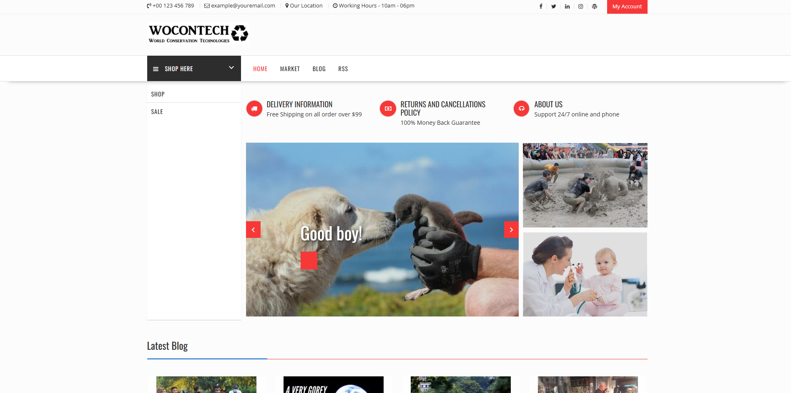

# Wocontech

**Client:** Wocontech  
**Industry:** Technology & Business Consulting  
**Technology Stack:** PHP, MySQL, WordPress, WooCommerce, Elementor, Astra Theme  
**Website:** [wocontech.com](https://wocontech.com)  
**Project Type:** Business Blog Website  
**Role:** Design and Development Partner  
**Challenge:** User-Centric Blog Design for a Technical Audience  

---

### 📝 Project Overview

Wocontech approached us with a vision: a sleek, professional blog that would serve as both a digital presence and an information hub for tech-focused content. The goal was to combine **beauty with simplicity**, offering a seamless content experience for their technology-savvy audience and business professionals.

---
### 🎯 Objectives

- Design a **contemporary, responsive** blog using WordPress  
- Create an attractive yet **minimalist layout** for smooth navigation  
- Ensure **scalability** via WooCommerce integration for future business growth  
- Structure content effectively for a **technical and professional audience**  

---
### ⚠️ Challenges

The key challenge centered around **designing a clean, user-first interface** that would appeal to a technical audience while projecting professionalism and authority. This involved:

- Maintaining proper **typography, spacing, and visual hierarchy**  
- Striking the right balance between **aesthetic appeal and functional clarity**  
- Keeping the layout simple but **content-rich and conversion-friendly**

---
### 💡 Our Solution

#### 🎨 Design
Utilized **Elementor** and the **Astra Theme** to build a clean and effective design. The homepage features:

- Popular blog posts  
- Category highlights  
- Strong, conversion-focused CTAs  

#### 🛠️ Customization
Despite Astra's minimal base, we enhanced the site with:

- **Custom widgets**  
- **Tailored styling** to align with Wocontech’s branding  

#### ⚡ Performance
- Optimized for **fast loading** and **responsive performance** across all devices  
- Focused on making **every blog article easy to read and navigate**

#### 🚀 Scalability
- Integrated **WooCommerce in the backend** to enable future product or service listings  
- Laid the foundation for **future business tools and monetization**

---
### ✅ Results

- 📱 **Responsive, modern blog website** aligned with Wocontech’s brand and goals  
- 💬 **Positive stakeholder feedback** on usability and design professionalism  
- 📊 **Improved content engagement** through structured layout and intuitive flow  
- 🔧 **Scalable architecture** ready for future e-commerce or service integration  

